# UK City (working title)

A Minecraft-style block game for building British towns. Lay out roads, junctions, signals and buildings quickly in a
top-down **city planner**, then drop into **first person** to walk around and break or place blocks by hand, in the
same world.

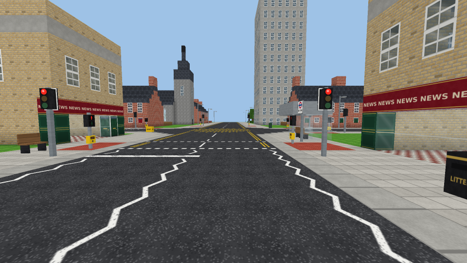

*Every image here comes from a headless software render of the real chunk meshes and textures (the same code the
game runs), not the Unity editor. Unity adds smoother texture filtering, but the geometry and artwork are identical.*

## Getting started

1. Install **Unity 6** (any 6000.x version) through Unity Hub.
2. In Unity Hub choose **Add > Add project from disk** and select this folder. If Hub asks about the editor
   version, pick whichever Unity 6 you have installed.
3. When the editor opens, press **Play**. There's no scene to set up: the game builds itself from code in any
   scene, including the empty default one.

The first launch drops you onto the high street of the starter town. **F5** saves and **F9** loads, and the game also
saves when you quit. To start again, press **Esc** and choose **New world** (starter town or empty).

> Unity creates `.meta` files for every script and shader the first time it opens the project. Commit them.

## Controls

| First person | |
|---|---|
| WASD / mouse | Move / look |
| Space | Jump (double-tap to fly) |
| F | Toggle fly |
| Shift | Sprint |
| Ctrl | Descend while flying |
| Left / right click | Break / place block (signs and props face you; road markings point the way you look) |
| Middle click | Pick the block you're looking at |
| 1–9, scroll | Hotbar |
| E | Block palette (tabs: nature, road, markings, building, street, signals, signs) |
| B | Buildings, signs, gantries and street furniture (ghost preview, R to rotate) |
| C, then C again | Capture the region between two corners as a new reusable template |
| Tab | Switch to the city planner |

| City planner (2D) | |
|---|---|
| WASD / arrows, middle-drag | Pan |
| Scroll | Zoom (towards the cursor) |
| 1 Select | Click roads, junctions or buildings; drag junctions to reshape roads; add signals or yellow boxes |
| 2 Road | Click to start, click to add sections, right click to stop. Shift snaps angles. Crossing roads make junctions |
| 3 Roundabout | Mini (painted), small or large |
| 4 Crossing | Zebra or puffin (signal controlled); click an existing crossing to switch type |
| 5 Signals | Click a junction to signalise it; Shift+click for a yellow box |
| 6 Road sign | Pick from about 90 UK signs; it lands at the kerb facing oncoming traffic. Gantries span the motorway |
| 7 Building | Pick a template; it turns to face the nearest road (R rotates) |
| 8 Bulldoze | Remove junctions, roads, crossings, buildings and signs |
| P | Walk here: drop into first person at the cursor |
| G / H | Chunk grid / hide the road overlay |

F1 shows the controls in game. Esc opens the menu, which can also switch textures between smooth and pixel-crisp.

## What's in it

**World**
- Infinite, chunk-streamed voxel world of 1 m blocks, generated and meshed on background threads, with ambient
  occlusion and face shading.
- Blocks have a facing and can be built from several boxes (like Minecraft block models), so signs are thin plates
  on posts, signal heads have backing boards, and lamps, cameras and benches have real shapes.
- 64 px textures, all painted procedurally at startup (no image assets) into a mip-mapped texture array so they stay
  clean at a distance. Sign lettering uses an embedded distance-field font.

**Roads and junctions (UK rules, left-hand traffic)**
- Road types: residential street, urban A-road, high street (double yellows), rural A-road, dual carriageway,
  motorway (3 lanes, hard shoulder, concrete central barrier, crash barriers) and country lane (hedgerows).
- Junctions get rounded kerbs automatically. Priority junctions put give way lines and triangles on the minor road.
  Hazard warning centre lines appear on the approaches, and roundabouts get give way lines at every entry.
- Signalised junctions get stop lines, lane arrows, studded pedestrian crossings with red tactile paving, primary
  and secondary signal heads, and pedestrian signals with push buttons. A yellow box junction is optional.
- Zebra crossings have stripes, zig-zags, give way lines and flashing Belisha beacons. Puffin crossings have studs,
  stop lines and their own signal cycle.

**Working signals and screens**
- Traffic lights run the UK sequence (red, red+amber, green, amber) in stages, with an all-red pedestrian stage when
  the green man shows. Heads work out which junction approach they control from where they stand and which way
  they face. Any heads you place by hand away from a junction run a shared two-phase cycle.
- Belisha beacons flash. So do school warning lights (alternating ambers) and vehicle-activated "30 / SLOW DOWN"
  signs. Motorway message signs cycle through messages, and smart-motorway lane signals change speed limits and
  close lanes.

**Signal hardware (all 3D, every lens lit on its own with a soft glow)**
- Modern LED heads, older-style heads with ribbed lenses and long hoods, and full arrow signals (left, ahead, right).
- Heads with a green filter arrow beside them, which runs while the main head is red and another stage is moving.
- Heads with an illuminated "no right turn" or "no left turn" pod, lit while that approach has green.
- Low-level cycle signals, far-side pedestrian heads, toucan heads (walk + cycle), puffin near-side units and push
  buttons with a WAIT lamp, Belisha beacons and school wig-wags.
- The planner's Signals tool cycles a junction between LED heads, older heads, and LED with filters and pods.

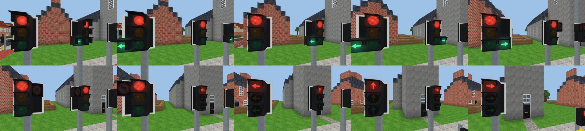

**Signs (about 90, all UK)**
- Speed limits 20 to 70, the national speed limit, 20 zone, and end of zone.
- Regulatory: stop, give way, no entry, no left/right/U-turn, no overtaking, weight limit, no waiting, clearway,
  mandatory arrows, mini roundabout, one way, bus lane.
- Warning: crossroads, T-junction, side road, staggered junction, roundabout, bends, road narrows, signals ahead,
  pedestrian crossing, children, cycles, slippery road, humps, road works, deer, cattle, two-way traffic, queues,
  uneven road, low bridge, falling rocks.
- School: patrol, School plate, School Keep Clear, "20 when lights show", and a flashing school warning assembly.
- Information and direction: parking, hospital, speed camera, bus stop, pedestrian zone, street name plates, local,
  tourist and primary route signs, and a "Welcome to Brickton" sign.
- Motorway: start/end of motorway, countdown markers, emergency area, route shield, an advance direction sign, and
  gantries with lane destination signs or lane signals plus a message screen.

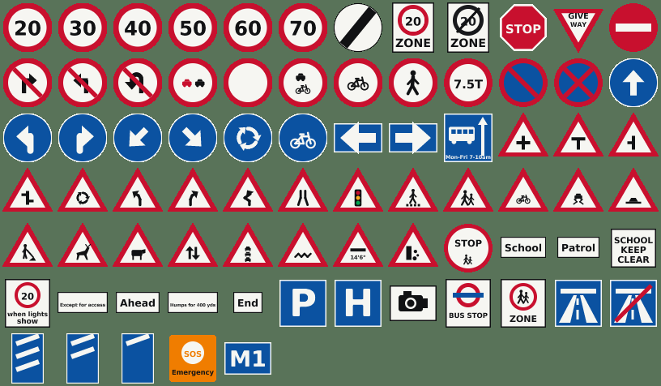
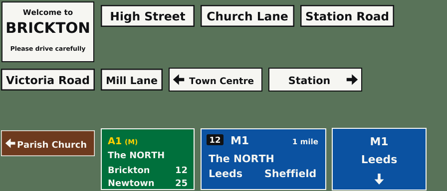

**Props**: speed camera, average speed camera, CCTV, classic and LED street lamps, bollards, keep-left bollards,
pedestrian guard rail, iron railings, crash barrier, concrete barrier, litter bin, grit bin, street cabinet, traffic
cones, roadworks barriers, bench, cycle stand, EV charger, emergency phone and marker posts.

**Buildings**: terraced house and terrace row, 1930s semis, corner shop, The Red Lion pub, council tower block,
parish church, pocket park, bus shelter, red phone box, pillar box and an oak tree. You can add your own with the
capture tool.

| | |
|---|---|
| 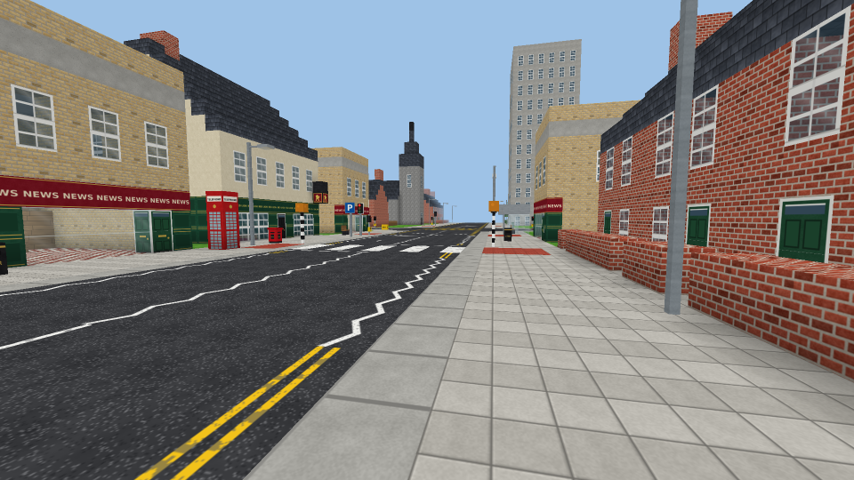 | 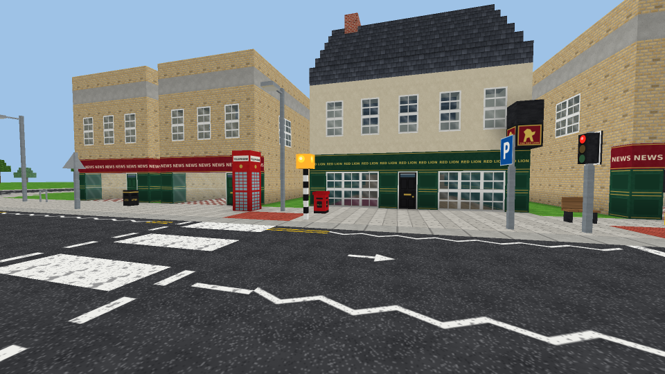 |
| 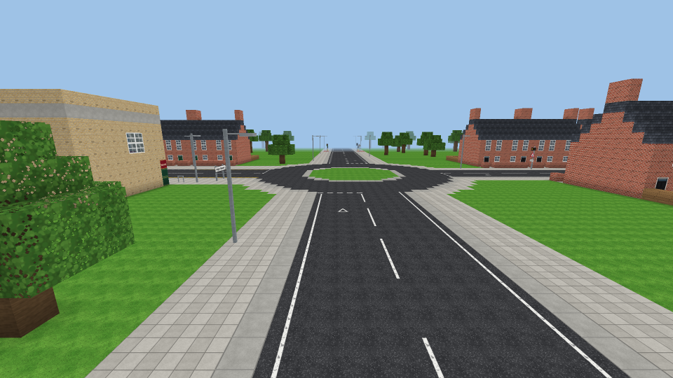 | 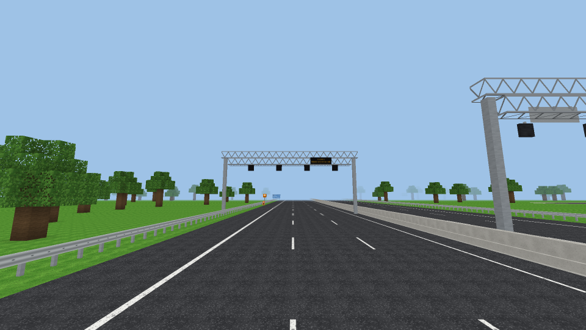 |
| 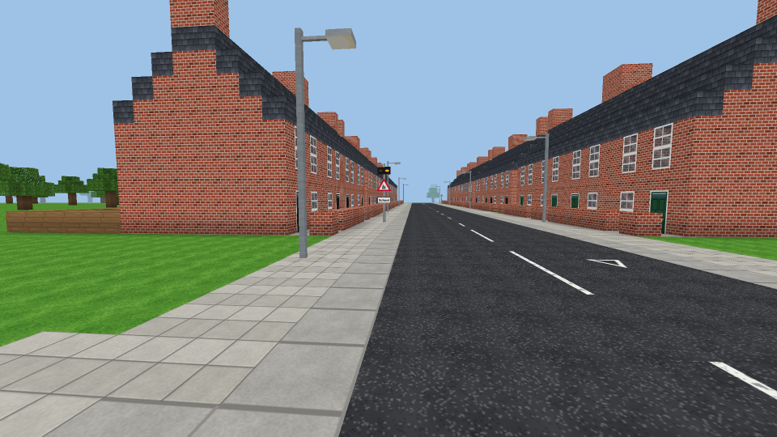 | 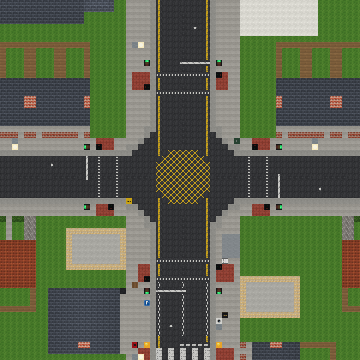 |

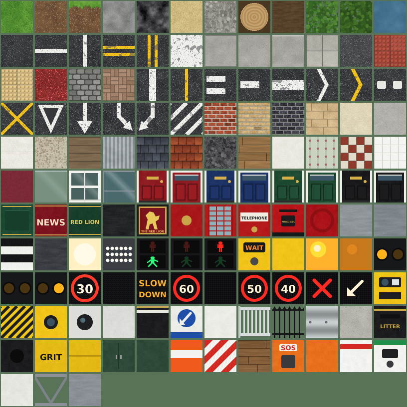

## How it fits together

The world is built from three layers, applied in order every time a chunk generates:

1. **Terrain**: flat English countryside with scattered oaks (`ChunkGenerator`).
2. **City plan** (`CityLayer`): a road graph of nodes (junctions, roundabouts, signals) and segments (road type,
   crossings), plus placed templates. `JunctionGeometry` turns it into markings, kerb corners and signal positions,
   and the rasteriser writes them into blocks.
3. **Hand edits** (`WorldEdits`): every block you place or break in first person, stored as a sparse per-chunk delta.

Because the road network is a real graph rather than painted blocks, you can redraw a road without losing your hand
building, and AI traffic will be able to path-find over the same graph (and obey the same signals) later.

```
Assets/
  Scripts/
    Core/       GameManager (modes, saving, actions), Bootstrap (auto-start), GameInput, LineBatch (overlays)
    World/      BlockState (id + facing), Blocks (registry, box models), ChunkGenerator, ChunkMesher,
                VoxelWorld (streaming), DynamicFaces (animated faces), TextureAtlas (texture array), WorldEdits
    World/Art/  PixelCanvas (anti-aliased painter), Noise, SignFont (+ generated SDF data), BlockPainter, Signs
    City/       RoadTypes, CityLayer, JunctionGeometry, TrafficSignals, SignPlacer, BuildingTemplate,
                BuildingLibrary, StarterTown
    Player/     PlayerController (voxel collision, fly), BlockInteractor (break/place, templates, capture)
    Planner/    PlannerController (2D tools)
    UI/         Hud (IMGUI)
    Save/       SaveSystem (JSON in Application.persistentDataPath; v1 saves are migrated)
  Resources/Shaders/   Unlit texture-array shaders (Built-in and URP), ghost and overlay shaders
Tools/compile-check/   Compiles the scripts against Unity's reference assemblies without the editor
Tools/fontgen/         Regenerates the sign font from a TTF
```

To check the scripts compile without Unity (CI runs this too):

```
dotnet build Tools/compile-check                    # legacy Input Manager path
dotnet build Tools/compile-check -p:NewInput=true   # Input System path
```

## Roadmap

- [x] Core loop: 2D road and city planner ↔ first-person block building in one world
- [x] UK road types, markings, roundabouts, zebra and puffin crossings, street furniture
- [x] Building templates, placeable from 2D and 3D, plus capturing your own
- [x] Rotatable blocks and box models; 64 px procedural textures; around 90 UK signs; motorway gantries
- [x] Working traffic signals, pedestrian signals, flashing beacons, message signs and lane signals
- [x] UK junction markings: give way, stop lines, triangles, hazard lines, zig-zags, yellow boxes, rounded kerbs
- [ ] Curved roads (Bézier), slip roads and one-way streets
- [ ] AI traffic driving on the left, obeying the signals and giving way (roundabouts clockwise)
- [ ] Pedestrians on pavements, pressing buttons and using crossings
- [ ] Buses with routes and stops
- [ ] Day/night cycle with working street lamps
- [ ] Opening doors, stairs and slab blocks
- [ ] Undo/redo in the planner
- [ ] Multiplayer (server-authoritative; plan edits and block edits are already separate, network-friendly actions)
