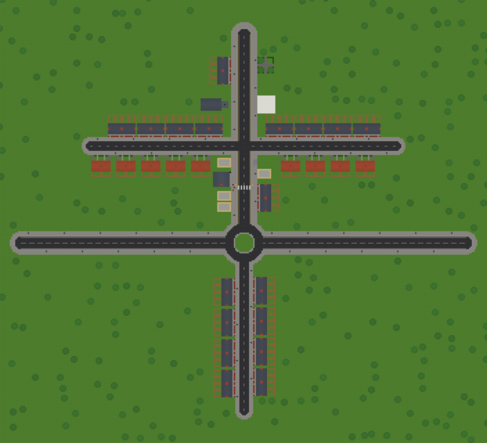
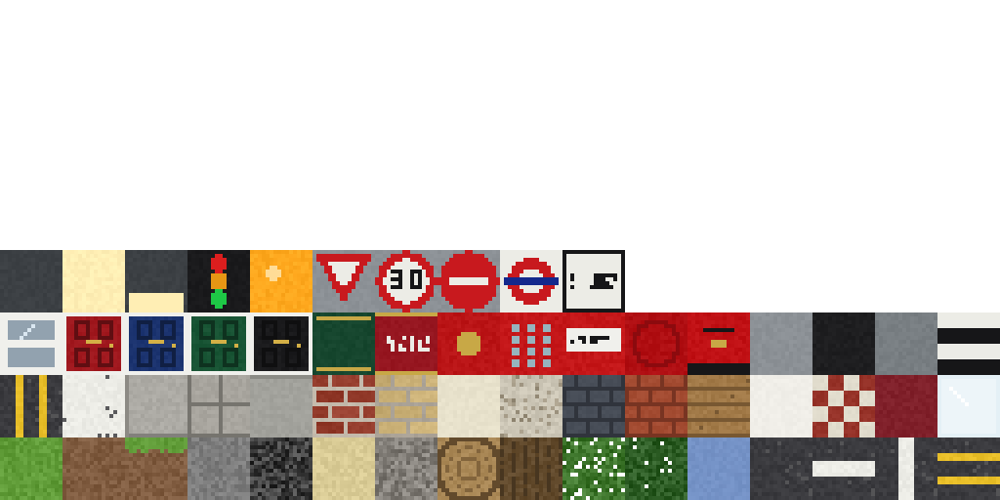

# UK City (working title)

A Minecraft-style block game for building British towns. Lay out roads, roundabouts and buildings quickly in a
top-down **city planner**, then drop into **first person** to walk around and break or place blocks by hand,
in the same world.



*The starter town, rendered headlessly from the real generator: an A-road with a roundabout, a high street with
shops, a pub and a zebra crossing, residential streets of terraces and semis, a church, a tower block and a park.*

## Getting started

1. Install **Unity 6** (any 6000.x version) through Unity Hub.
2. In Unity Hub choose **Add > Add project from disk** and select this folder. If Hub asks about the editor
   version, pick whichever Unity 6 you have installed.
3. When the editor opens, press **Play**. There's no scene to set up: the game builds itself from code in any
   scene, including the empty default one.

The first launch drops you into the starter town. **F5** saves and **F9** loads, and the game also saves when you
quit. To start again, press **Esc** and choose **New world** (starter town or empty).

> Unity creates `.meta` files for every script and shader the first time it opens the project. Commit them.

## Controls

| First person | |
|---|---|
| WASD / mouse | Move / look |
| Space | Jump (double-tap to fly) |
| F | Toggle fly |
| Shift | Sprint |
| Ctrl | Descend while flying |
| Left / right click | Break / place block |
| Middle click | Pick the block you're looking at |
| 1–9, scroll | Hotbar |
| E | Block palette |
| B | Building templates (place in 3D with a ghost preview, R to rotate) |
| C, then C again | Capture the region between two corners as a new reusable template |
| Tab | Switch to the city planner |

| City planner (2D) | |
|---|---|
| WASD / arrows, middle-drag | Pan |
| Scroll | Zoom (towards the cursor) |
| 1 Select | Click roads, junctions or buildings; drag junctions to reshape roads |
| 2 Road | Click to start, click to add sections, right click to stop. Shift snaps angles. Crossing an existing road makes a junction |
| 3 Roundabout | Mini (painted), small or large; click a junction, a road or empty ground |
| 4 Zebra crossing | Click a road with pavements; Belisha beacons are added for you |
| 5 Building | Pick a template; it turns to face the nearest road (R rotates) |
| 6 Bulldoze | Remove junctions, roads, crossings and buildings |
| P | Walk here: drop into first person at the cursor |
| G / H | Chunk grid / hide the road overlay |
| Tab | Back to first person |

F1 shows the controls in game. Esc opens the menu.

## What's in it

- **Infinite, chunk-streamed voxel world** of 1 m blocks, generated and meshed on background threads, with ambient
  occlusion and face shading.
- **UK road types**: residential street, A-road, high street (double yellow lines), dual carriageway (with a grass
  central reservation) and country lane (verges and hedgerows). Dashed white centre lines, clean junction boxes,
  automatic street lamps, zebra crossings with Belisha beacons, and mini, small and large roundabouts.
- **19 building templates**: terraced house, terrace row, 1930s semis, corner shop, pub, council tower block, parish
  church, pocket park, bus shelter, red phone box, pillar box, street lamp, traffic lights, Belisha beacon, give way,
  30 and no-entry signs, street name plate and an oak tree. You can add your own with the capture tool.
- **53 blocks**, all procedurally drawn pixel art (no image assets): brick, London stock brick, pebbledash,
  render, slate, clay tiles, sash windows, coloured front doors, kerbs, paving slabs, road markings, signs and more.



## How it fits together

The world is built from three layers, applied in order every time a chunk generates:

1. **Terrain**: flat English countryside with scattered oaks (`ChunkGenerator`).
2. **City plan** (`CityLayer`): a road graph of nodes and segments plus placed building templates. The 2D planner
   edits this layer, and it's rasterised into blocks: road cross-sections, markings, roundabouts, lamps and buildings.
3. **Hand edits** (`WorldEdits`): every block you place or break in first person, stored as a sparse per-chunk delta.

Because the road network is a real graph rather than painted blocks, you can redraw a road without losing your hand
building, and AI traffic will be able to path-find over the same graph later.

```
Assets/
  Scripts/
    Core/     GameManager (modes, saving, actions), Bootstrap (auto-start), GameInput, LineBatch (overlays)
    World/    Blocks, TextureAtlas, ChunkGenerator, ChunkMesher, VoxelWorld (streaming), WorldEdits, VoxelRaycast
    City/     RoadTypes, CityLayer (road graph + buildings), BuildingTemplate, BuildingLibrary, StarterTown
    Player/   PlayerController (voxel collision, fly), BlockInteractor (break/place, templates, capture)
    Planner/  PlannerController (2D tools)
    UI/       Hud (IMGUI)
    Save/     SaveSystem (JSON in Application.persistentDataPath)
  Resources/Shaders/   Unlit voxel, transparent, ghost and overlay shaders (work in Built-in and URP)
Tools/compile-check/   Compiles the scripts against Unity's reference assemblies without the editor
```

To check the scripts compile without Unity (CI runs this too):

```
dotnet build Tools/compile-check                    # legacy Input Manager path
dotnet build Tools/compile-check -p:NewInput=true   # Input System path
```

## Roadmap

- [x] Core loop: 2D road and city planner ↔ first-person block building in one world
- [x] UK road types, markings, roundabouts, zebra crossings, street furniture
- [x] Building templates, placeable from 2D and 3D, plus capturing your own
- [ ] Give-way and stop lines at junctions; traffic lights that cycle
- [ ] Curved roads (Bézier) and one-way streets
- [ ] AI traffic driving on the left, using the road graph (roundabouts clockwise, giving way)
- [ ] Pedestrians on pavements and zebra crossings
- [ ] Buses with routes and stops
- [ ] Day/night cycle with working street lamps
- [ ] Opening doors, stairs and slab blocks, signs that face a direction
- [ ] Undo/redo in the planner
- [ ] Multiplayer (server-authoritative; plan edits and block edits are already separate, network-friendly actions)
